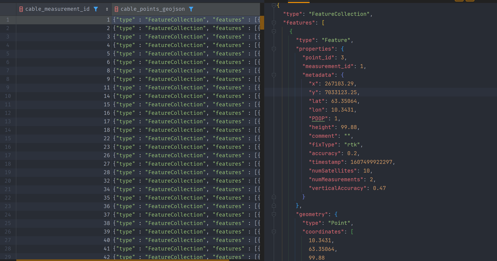

# CableNetworkVisualization

This project integrates an Angular front-end with a FastAPI back-end to visualize terrain data and cable network inquiries. The terrain data is processed using Docker and served through a Cesium Terrain Server.

## Table of Contents

1. [Development Server](#development-server)
2. [Backend](#backend)
3. [Installing Docker](#installing-docker)
4. [Running Docker Containers](#running-docker-containers)
5. [Code Scaffolding](#code-scaffolding)
6. [Build](#build)
7. [Running Unit Tests](#running-unit-tests)
8. [Running End-to-End Tests](#running-end-to-end-tests)
9. [Further Help](#further-help)

## Development Server

Run `ng serve` for a dev server. Navigate to `http://localhost:4200/`. The application will automatically reload if you change any of the source files.

## Backend 

The backend is comprised of a Postgres database (geomelding-5) which contains the related data for the all cable networks and is accesiable thorugh a FastAPI which is built on top on the database to extract the necessary data.


*Preview of the data related to the measurements in the form of measured points*

The FastAPI which includes different endpoints for extracting data about the cable networks is defined thorugh SQL files that are executed on the database to obtain the specifed information. The SQL files include queries and views to systematically organize the data recived from the measurements into both GeoJSON for the measurement data itself and JSON for the information about the related inquiries. The GeoJSON format is known for its compatibility with various geographic information system (GIS) tools, enables the visualization of these cables with ease. This approach ensures that the data is readily available for integration with Cesium, as well as other frameworks and libraries that support GeoJSON.


*Example of a query used to compose measurement data into GeoJSON format*

The database has a schema "analytics_cable_measurement_inquiries" which is a subset of the public schema containing all the relevant information for the cable networks. In this schema you will find materialized views which represent the subsets of the tables in the public schema (Should be made into tables in the future). 



*Preview of the view which represents all cables in GeoJSON format*


### Setup

1. **Install Dependencies:**

   - Ensure you have Python 3.8+ installed.
   - Set up a Python virtual environment:

     ```sh
     python -m venv venv
     source venv/bin/activate  # On Windows use `venv\Scripts\activate`
     ```

   - Install the required Python packages:

     ```sh
     pip install -r requirements.txt
     ```

2. **Database Setup:**

   - Create a `.env` file in the `backend` directory with the following content:

     ```sh
     DB_NAME=your_db_name
     DB_USER=your_db_user
     DB_PASSWORD=your_db_password
     DB_HOST=your_db_host
     DB_PORT=your_db_port
     ```

3. **Running the Backend:**

   - Run the FastAPI server:

     ```sh
     cd backend
     uvicorn main:app --reload
     ```

   - The backend server will be available at `http://localhost:8000`.

### Installing Docker

1. **Install Docker:**

   - Follow the instructions on the [Docker website](https://docs.docker.com/get-docker/) to install Docker for your operating system.

2. **Verify Docker Installation:**

   - After installation, verify that Docker is installed correctly by running:

     ```sh
     docker --version
     ```

### Running Docker Containers

1. **Build the Docker Image:**

   - Build the Docker image using the Dockerfile provided in the repository:

     ```sh
     docker build -t cesium-terrain-builder .
     ```

2. **Run the Docker Container to Generate Terrain Tiles:**

   - Run the Docker container to generate terrain tiles. The `-v` option mounts the local directory to the Docker container. Use the command based on your operating system:

   - **Linux - bash:**

     ```sh
     docker run -it --name ctb -v "/docker/terrain:/data" cesium-terrain-builder
     ```

   - **Windows - cmd:**

     ```sh
     docker run -it --name ctb -v "c:/docker/terrain:/data" cesium-terrain-builder
     ```

   - **Windows - git-bash:**

     ```sh
     winpty docker run --rm -it --name ctb -v "c:\\docker\\terrain:/data" cesium-terrain-builder
     ```

   - **Windows - powershell:**

     ```sh
     docker run -it --name ctb -v "c:\docker\terrain:/data" cesium-terrain-builder
     ```

3. **Run Cesium Terrain Server:**

   - Pull the Cesium Terrain Server image:

     ```sh
     docker pull nmccready/cesium-terrain-server
     ```

   - Run the Cesium Terrain Server to serve the terrain tiles:

     ```sh
     docker run -p 8080:8000 --name cesium-terrain-server -v "C:/docker/terrain:/data/tilesets/terrain" nmccready/cesium-terrain-server
     ```

## Code Scaffolding

Run `ng generate component component-name` to generate a new component. You can also use `ng generate directive|pipe|service|class|guard|interface|enum|module`.

## Build

Run `ng build` to build the project. The build artifacts will be stored in the `dist/` directory.

## Running Unit Tests

Run `ng test` to execute the unit tests via [Karma](https://karma-runner.github.io).

## Running End-to-End Tests

Run `ng e2e` to execute the end-to-end tests via a platform of your choice. To use this command, you need to first add a package that implements end-to-end testing capabilities.

## Further Help

To get more help on the Angular CLI use `ng help` or go check out the [Angular CLI Overview and Command Reference](https://angular.dev/tools/cli) page.

---

### Additional Notes

- **Fetching and Processing GeoTIFF Files:**
  The backend endpoints `/fetch-geotiff` and `/process-geotiff` handle fetching and processing GeoTIFF files to generate terrain tiles.
- **Directory Structure:**

  - The terrain tiles are stored in the `C:/docker/terrain/output` directory.
  - Ensure Docker has access to the `C:/docker/terrain` directory for volume mounting.

- **Logging:**
  The backend uses logging to track the status of operations. Logs are stored in the `app.log` file.

- **API Endpoints:**


*Preview of Swagger documentation of the API*

- `GET /`: Reads the root of the API.
- `GET /inquiries`: Retrieves a list of inquiries.
- `GET /geometries/area/boundary/inquiry/{inquiry_id}`: Gets the area boundary geometry for a specific inquiry.
- `GET /geometries/area/working_area/inquiry/{inquiry_id}`: Gets the working area geometry for a specific inquiry.
- `GET /geometries/measurements/inquiry/{inquiry_id}`: Retrieves all geometric data associated with a specific inquiry.
- `GET /geometries/measurements/cable_points/inquiry/{inquiry_id}`: Gets the cable point measurements geometry for a specific inquiry.
- `GET /fetch-geotiff`: Fetches a GeoTIFF file.
- `GET /process-geotiff`: Processes a GeoTIFF file.
- `GET /images/inquiry/{inquiry_id}`: Retrieves images related to a specific inquiry.
- `PUT /update-coordinates/{edited_point_id}`: Updates the coordinates of a specified point.

Ensure you follow these steps to set up the project correctly. For any issues or further assistance, refer to the project documentation or reach out to the development team.

### Credits

- The Cesium Terrain Builder Docker setup is based on [tum-gis/cesium-terrain-builder-docker](https://github.com/tum-gis/cesium-terrain-builder-docker).
